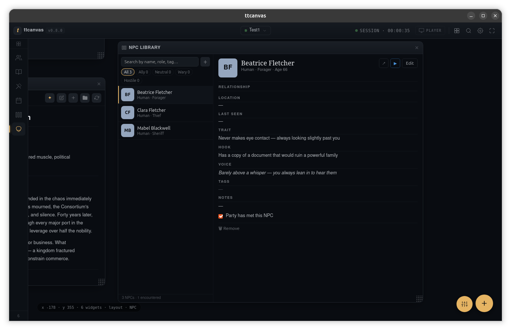
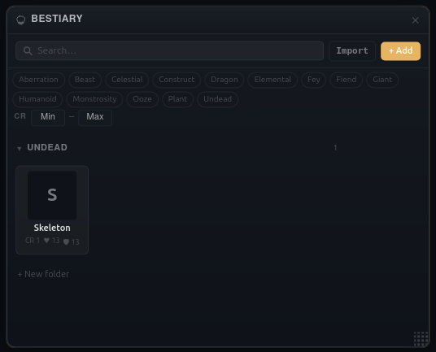

# TTCanvas

[](LICENSE)
[](https://discord.gg/ADvK4HEwFE)
[](https://ko-fi.com/Q5Q51ZDEPT)

A tabletop RPG session companion. A freeform canvas of widgets for dice rolling, NPC management, party tracking, initiative, maps, session notes, ambient sound, and more. Built with Tauri 2 + React 19 + TypeScript + Rust.

TTCanvas is a **GM screen**, not a virtual tabletop. It runs locally, stores everything in a plain folder you own, and never phones home.

## Fifth-edition compatibility and attribution

TTCanvas is independent, unofficial software. It is not approved, endorsed, or sponsored by
Wizards of the Coast. Its optional 5E-compatible material is based on the 2024 rules released in
the System Reference Document 5.2.1. TTCanvas adapts selected rules from that document for its
generator and stat-block tools; it does not reproduce the full SRD.

This work includes material from the System Reference Document 5.2.1 ("SRD 5.2.1") by Wizards of
the Coast LLC, available at <https://www.dndbeyond.com/srd>. The SRD 5.2.1 is licensed under the
Creative Commons Attribution 4.0 International License, available at
<https://creativecommons.org/licenses/by/4.0/legalcode>.

---

## Screenshots




---

## Install

Download the installer for your OS from the [Releases](../../releases/latest) page:

| Platform | File |
|----------|------|
| Linux | `TTCanvas_x.y.z_amd64.AppImage` or `.deb` |
| Windows | `TTCanvas_x.y.z_x64-setup.exe` |
| macOS | TBA |

Linux AppImage: `chmod +x TTCanvas_*.AppImage && ./TTCanvas_*.AppImage`

---

## Quick start

1. Launch TTCanvas.
2. Click the vault crumb in the titlebar and choose a folder. This becomes your **vault** (a plain directory that holds all your session files).
3. Press `Cmd/Ctrl+K` (command palette) and type a widget name to open it, or click the **+** FAB.
4. Drag and resize widgets freely. Pan the canvas with two-finger scroll (trackpad) or middle-mouse drag; zoom with pinch or Ctrl+scroll.
5. Press `Cmd/Ctrl+S` inside a note to save. Everything else auto-saves.

Your vault is just a folder. Zip it, put it in Dropbox, or commit it to git.

---

## Features

### Canvas & chrome

- **Freeform canvas**: pan, zoom, place and resize any widget freely; multi-select with marquee or Shift-click; drag groups of widgets together
- **Multiple layouts**: switch, rename, create, and delete named layouts; each layout has its own widget arrangement
- **Widget Rail**: live sidebar listing every open widget; click to pan-and-focus, drag to reorder z-stack
- **Command palette**: `Cmd/Ctrl+K` to open any widget, jump to NPCs, open notes files, or navigate calendar events
- **Keyboard shortcuts**: `?` for the shortcut overlay; `Del/Backspace` to close focused widget; `Cmd+Z` to undo last move/resize; `Cmd+G` to toggle grid
- **Preferences modal**: themes (Dark Vellum, Dark Amber), accent colours (amber / plum / moss / ink), density (Compact / Comfortable / Spacious), reduce-motion toggle
- **Player Window**: a separate output window for your players. Push the current map with fog-of-war reveals and in-game time, or send a cinematic character card from NPC Library, Bestiary, or Party Tracker. Position and size are remembered across sessions.

### Widgets

- **Dice Roller**: d4-d100, advantage/disadvantage, custom expressions (`2d6+3`), result history
- **Party Tracker**: HP / AC / initiative / passive Perception per character; portrait; inspiration toggle; custom stat fields; drag-to-reorder; death save pips; condition badges; ▶ send a cinematic PC card to the Player Window
- **Initiative Tracker**: round counter; PC / foe / ally kind pips; HP bar; sort by initiative; current-turn NOW badge; add from Bestiary
- **Map Display**: pan/zoom image viewer with grid overlay; auto-fit on load; zoom toolbar (Fit, 1:1, −, +); multiple scenes (tab strip, rename, add/delete); fog-of-war brush (reveal/hide); drag tokens from Bestiary or NPC Library; player window output
- **Session Notes**: folder-tree file browser; inline Markdown and `.txt` editing; `[[Wikilink]]` navigation between notes; `Cmd+S` to save
- **Custom Calendar**: define months, week day names, and leap-year rules; track in-game date and time; event log; export/import preset files; time shown in Player Window
- **Time Tracker**: advance in-game hours and minutes; history log; synced to Calendar widget
- **Sound Board**: ambient audio loop grid; per-pad volume; loop toggle; Stop All button
- **NPC Generator**: random name / species / role / age / description with per-field lock; campaign context textarea; optional SRD 5.2.1 combat stat generation; save directly to NPC Library; optional AI description generation (Ollama or any OpenAI-compatible API, not required to use the widget)
- **NPC Library**: vault-resident NPC sheets with 5E-compatible stat blocks; search; relationship filter; portrait upload/crop; export and import `.npc-library.json` bundles; ▶ cinematic character card to Player Window
- **Bestiary**: creature library with folder tree; portraits; CR / HP / AC; add directly to Initiative Tracker; drag creature onto Map Display to place as a token; ▶ cinematic creature card to Player Window
- **Session Logger**: timestamped session log (in-game time from Time Tracker); export to `.md` via native save dialog; optional AI summary streamed into a collapsible panel (requires AI configured in Preferences)

### Custom widgets (mods)

Place a pre-built ESM JavaScript file in `{vault}/mods/` to add your own widgets without recompiling. See [Mod authoring](#mod-authoring) below.

---

## Vaults

A vault is a local folder where TTCanvas saves files: workspace layout, session notes, NPC sheets, bestiary entries, maps, portraits, and audio. Open a vault via the titlebar crumb button or on first launch. Multiple vaults can be switched from the dropdown; recent vaults are remembered.

File layout inside a vault:

```
vault/
  .ttcanvas/
    workspace.json   # widget positions, layouts, singleton state
  notes/             # session notes (.md, .txt)
  npcs/              # saved NPC sheets (.npc.json)
  bestiary/          # creature entries and folder structure (.creature.json)
  maps/              # images picked via Map Display
  portraits/         # character and NPC portrait images
  audio/             # audio files used by Sound Board
  mods/              # custom widget JS files
```

---

## AI features (optional)

AI is entirely optional. Every widget works without it. If you want it, two widgets can use a language model: the **NPC Generator** (personality descriptions) and the **Session Logger** (session summary). Configure the provider once in **Preferences → Canvas → AI provider**. Two backends are supported: **Ollama** (local, free, no API key) and any **OpenAI-compatible API** (OpenAI, Groq, OpenRouter, LM Studio, etc.).

All HTTP calls go through Rust, so the frontend never makes direct network requests. This avoids CORS issues inside the Tauri WebView and keeps API keys out of JS.

### Option A: Ollama (local, recommended)

1. Install [Ollama](https://ollama.com/).
2. Pull a model:
   ```bash
   ollama pull llama3
   # or any other model: mistral, phi3, gemma2, etc.
   ```
3. Start the server (usually auto-started after installation):
   ```bash
   ollama serve
   ```
4. In TTCanvas, open **Preferences → Canvas → AI provider**, select **Ollama**, and choose a model from the dropdown.
5. Open the NPC Generator and click **✦ AI Describe**, or open Session Logger and click **AI Summary**.

If Ollama is not running the AI buttons are disabled (no crash, no error state).

### Option B: OpenAI-compatible API

In **Preferences → Canvas → AI provider**, switch to the **OpenAI-compatible** tab. Three fields:

| Field | Example |
|---|---|
| Base URL | `https://api.openai.com` |
| API key | `sk-…` (leave blank for local servers) |
| Model | enter manually or click **Load models** |

#### Example providers

| Provider | Base URL | API key |
|---|---|---|
| OpenAI | `https://api.openai.com` | from platform.openai.com |
| Groq | `https://api.groq.com/openai` | from console.groq.com |
| OpenRouter | `https://openrouter.ai/api` | from openrouter.ai |
| LM Studio | `http://localhost:1234` | any string (or blank) |
| Ollama (OpenAI mode) | `http://localhost:11434` | any string (or blank) |

> The API key is stored in `app_config.json` in the OS app-data directory, not inside the vault. Keep that file private if you use a real API key.

---

## Mod authoring

You can add your own widgets to any vault without recompiling TTCanvas. Place a pre-built ESM JavaScript file in `{vault}/mods/` and it will be picked up automatically when that vault opens.

### Trust and security

Mods are **not sandboxed**. A mod file runs inside TTCanvas's own window with the same access
TTCanvas has: the DOM, your vault's files, and every Tauri command TTCanvas itself can call. Only
add mods you wrote yourself or that come from someone you trust completely - treat a mod file the
same way you'd treat an executable, not a config file.

The first time a vault contains a mod file TTCanvas hasn't seen before (tracked by the file's
content, not its name), you'll be asked to approve it before it loads. Editing a trusted mod's
content asks again, since the approval is tied to what the file actually contains.

### Requirements

- **One file per widget**: `{vault}/mods/my-widget.js`
- **Pre-built ESM**: TypeScript/JSX must be compiled before placing in the folder. Use [esbuild](https://esbuild.github.io/) or Vite.
- **Two required exports:**
  - `export const definition`: widget metadata
  - `export default`: React component `({ state, onChange }) => JSX`
- **Report your failures**: log anything your widget catches and handles, via `window.ttcanvas.log`. See [Diagnostics and logging](#diagnostics-and-logging) below. A mod that fails silently is one nobody can help you debug.

### Minimal example

```tsx
// my-counter.tsx  →  build with:
// npx esbuild my-counter.tsx --bundle --format=esm --outfile=mods/my-counter.js

import { useState } from "react";

export const definition = {
  type: "custom-counter",   // must be globally unique; prefix with your initials
  title: "Counter",
  category: "Custom",
  defaultSize: { width: 200, height: 150 },
  defaultState: { count: 0 },
};

export default function Counter({ state, onChange }: { state: any; onChange: (s: any) => void }) {
  return (
    <div style={{ padding: 16, textAlign: "center" }}>
      <div style={{ fontSize: 48 }}>{state.count}</div>
      <button onClick={() => onChange({ count: state.count + 1 })}>+1</button>
    </div>
  );
}
```

### Diagnostics and logging

TTCanvas keeps a local log file and shows it in **Preferences → Diagnostics**, where it can be
exported as a redacted report to attach to a bug report. Nothing is ever sent anywhere
automatically. Mods write to that same log through `window.ttcanvas`, so a mod's problems land
next to everything else instead of disappearing.

Two things are already logged for you, without any work:

- **A crash while rendering** your widget, caught by the per-widget error boundary. The widget
  shows an error frame instead of taking the app down with it.
- **An uncaught error or rejected promise** from your code, caught by the app's global handlers.

What isn't logged for you is the common case: an error you catch yourself and recover from. Those
are exactly the failures that turn into "it just shows nothing" bug reports, so log them.

```js
// window.ttcanvas.log.warn - a recoverable failure; the widget carried on
// window.ttcanvas.log.error - something the user asked for did not happen
// window.ttcanvas.log.info  - noteworthy, but not a fault

try {
  const raw = await fetchSomething();
  setData(JSON.parse(raw));
} catch (err) {
  window.ttcanvas.log.warn("My Widget: could not load its data", err);
  setData(null);   // degrade, but leave a trace
}
```

Conventions worth following, so a report stays readable:

- **Name your widget** at the start of the message, as it appears in the UI. Every line is already
  tagged `[mod]`, but that only says third-party, not which one.
- **Say what failed and which item**, e.g. `"My Widget: could not read \"goblins.json\""`.
- **Pass the error** as the second argument rather than concatenating it. It is formatted, and
  API keys and home-directory usernames are stripped, before anything is written.
- **Don't log inside a loop or on every render.** A line per frame buries everything else.
- **Stay quiet about expected failures.** A probe for an optional service that isn't running is
  not a fault, and logging it every session makes the log useless.

For TypeScript, copy [`src/mods/ttcanvas-mod-api.d.ts`](src/mods/ttcanvas-mod-api.d.ts) next to
your source and `window.ttcanvas` will typecheck. Check `window.ttcanvas.apiVersion` if you need
to support older TTCanvas builds, which may not have this API at all.

Note that this grants a mod nothing it did not already have - mods run unsandboxed with full DOM
and IPC access, as the trust prompt says. It only gives you somewhere to write.

### How mods load

- Mods are scanned and loaded each time a vault opens or switches.
- To reload a mod you've edited while the same vault is open: switch to another vault and switch back (or restart the app).
- A broken mod file is skipped with a warning (it won't crash the app).
- Widget state for mod widgets is saved normally in `workspace.json`. If a mod is missing when the vault opens, the widget frame shows "Unknown widget type" until the mod file is restored.

### Available fields in `definition`

| Field | Type | Required |
|---|---|---|
| `type` | `string` | yes (unique ID) |
| `title` | `string` | yes |
| `category` | `string` | yes (shown in widget picker) |
| `defaultSize` | `{ width, height }` | yes |
| `defaultState` | `any` (JSON-serializable) | yes |
| `singleton` | `boolean` | no (if true, only one instance) |
| `minWidth` | `number` | no |
| `minHeight` | `number` | no |
| `icon` | `string` | no |

---

## Development

### Prerequisites

- [Rust](https://rustup.rs/) (stable)
- [Node.js](https://nodejs.org/) 24.x
- [pnpm](https://pnpm.io/)
- [Tauri CLI prerequisites](https://tauri.app/start/prerequisites/) for your OS

```bash
pnpm install
pnpm tauri dev
```

### Build

```bash
pnpm tauri build
```

### Tests

```bash
# Frontend (TypeScript)
pnpm typecheck
pnpm test

# Backend (Rust)
cargo test --manifest-path src-tauri/Cargo.toml
```

---

## Architecture notes

- `src/`: React app, canvas engine, chrome (Titlebar, Widget Rail), widget host (`WidgetFrame`)
- `packages/core/`: shared types, `VaultContext`, `PartyContext`, `CalendarContext`, `ITContext`, Tauri invoke wrappers
- `packages/widgets-builtin/`: all built-in widget implementations
- `src-tauri/`: Rust backend, vault I/O, workspace persistence, Ollama/OpenAI HTTP proxying, file dialogs, player window management, clean-shutdown guard
- CSS Modules throughout; design tokens in `src/styles/tokens.css` (oklch colour space); theme + accent + density applied as `data-*` attributes on `<body>`

---

## Contributing

Bug reports and feature requests are welcome via [GitHub Issues](../../issues). Pull requests are welcome too; open an issue first to discuss larger changes.

Join the community on [Discord](https://discord.gg/ADvK4HEwFE).

---

## Licence

GPL-3.0-or-later. See [LICENSE](LICENSE).

Plugins loaded via the official Plugin SDK are not considered derivative works; see the Plugin Exception in LICENSE.
